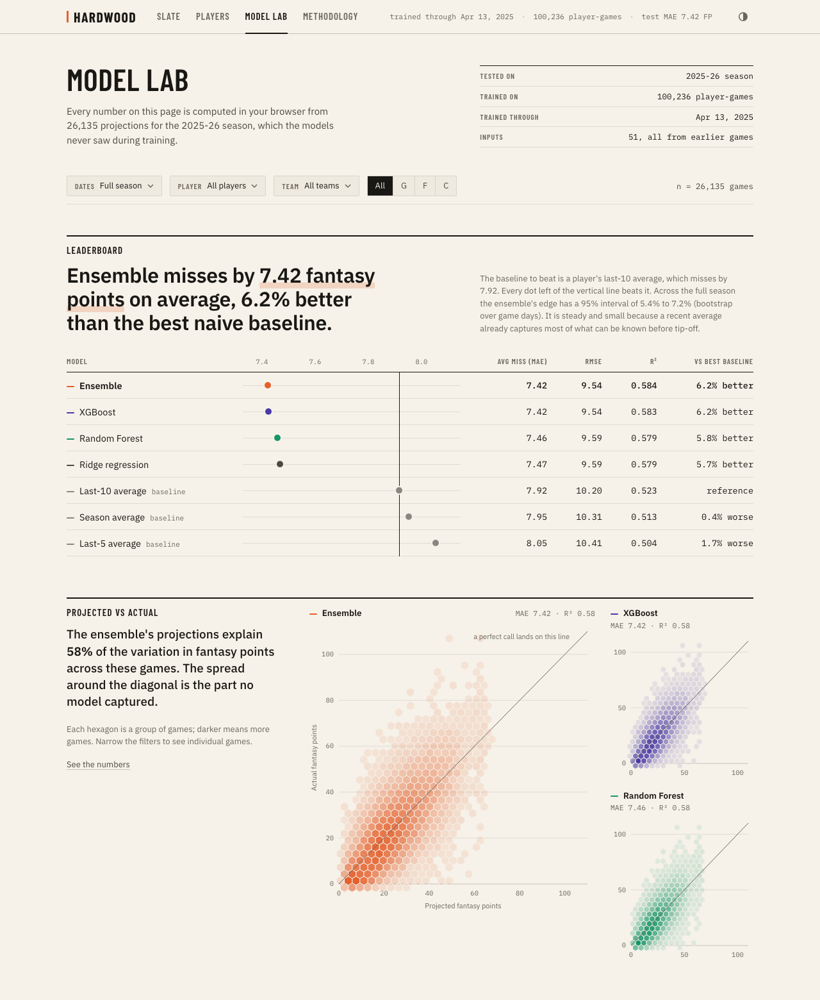
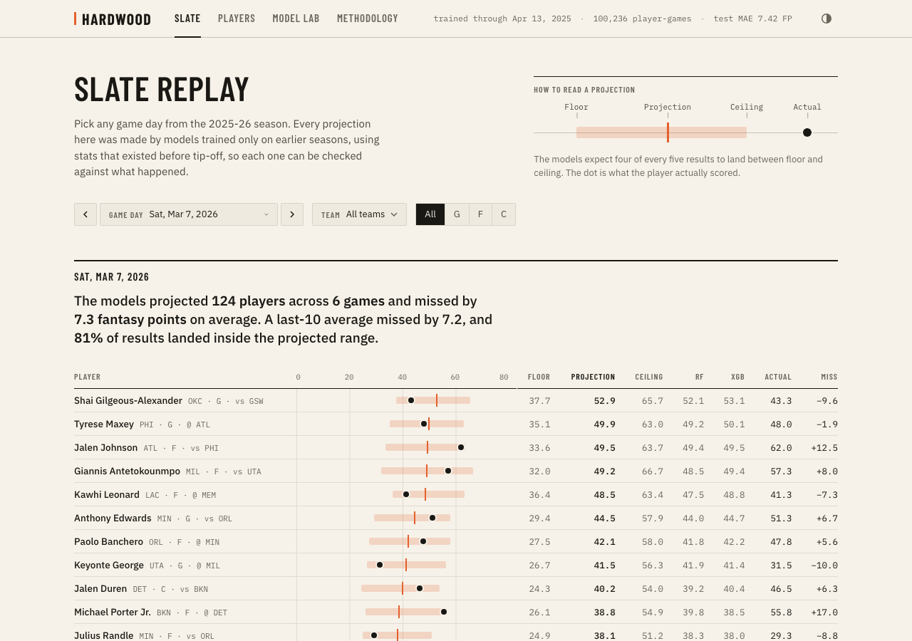
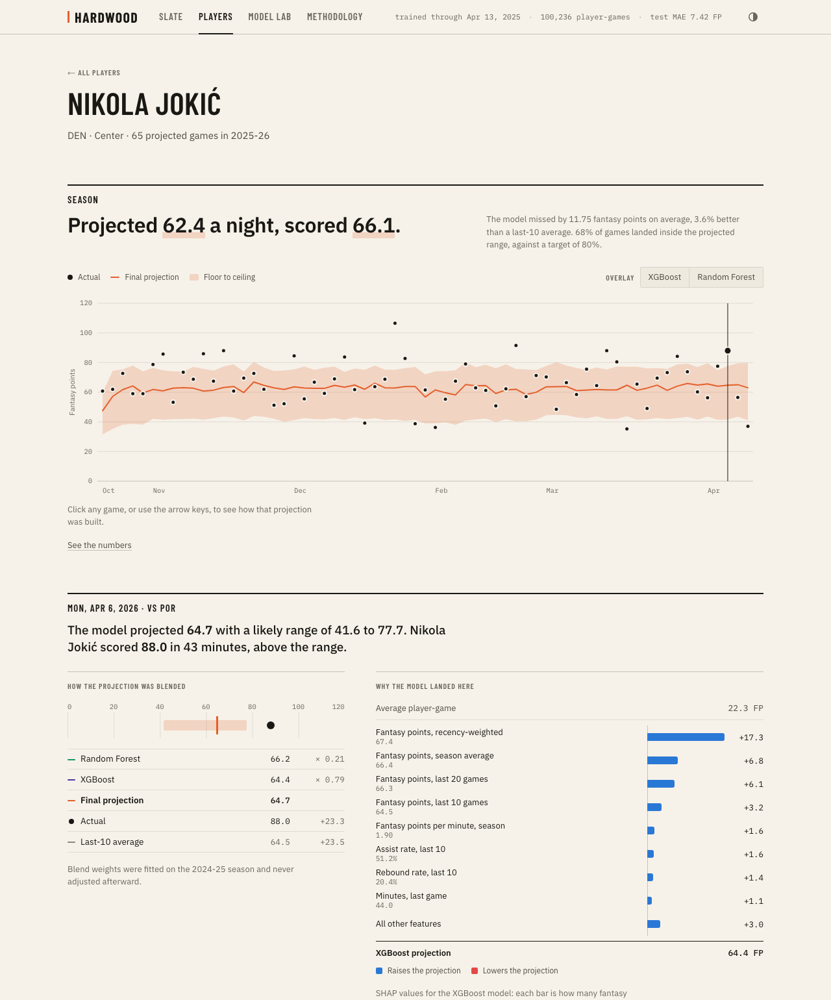

# Hardwood

NBA fantasy-point projections from Random Forest and XGBoost, tested on a full season the models never saw.

**Live app:** https://dheerajkoppu.github.io/hardwood/

Every number in the app comes from a trained model and a real evaluation run. Nothing is hard-coded: the training script writes its predictions and metrics to JSON, and the web app computes every chart from those files in the browser.



## Results

Test season: 2025-26, 26,135 player-games across 566 players. Models were trained on 2021-22 through 2024-25 (100,236 player-games). Target is DraftKings fantasy points.

| Model                                            | MAE      | RMSE     | R²        | vs best baseline |
| ------------------------------------------------ | -------- | -------- | --------- | ---------------- |
| **Ensemble** (0.79 XGBoost + 0.21 Random Forest) | **7.42** | **9.54** | **0.584** | **6.2% better**  |
| XGBoost                                          | 7.42     | 9.54     | 0.583     | 6.2% better      |
| Random Forest                                    | 7.46     | 9.59     | 0.579     | 5.8% better      |
| Ridge regression                                 | 7.47     | 9.59     | 0.579     | 5.7% better      |
| Last-10 average (best baseline)                  | 7.92     | 10.20    | 0.523     | reference        |
| Season average                                   | 7.95     | 10.31    | 0.513     | 0.4% worse       |
| Last-5 average                                   | 8.05     | 10.41    | 0.504     | 1.7% worse       |

The ensemble's improvement over the best baseline has a 95% confidence interval of 5.4% to 7.2% (bootstrap resampling whole game days).

### What the evaluation showed

- **The edge is real and small.** A player's recent average already captures most of what is knowable before tip-off. The models take the average miss from 7.92 to 7.42 fantasy points.
- **Features matter more than the model class.** Ridge regression captures 91% of the ensemble's gain over the baseline with no non-linear modeling. XGBoost and Random Forest add the last 9%.
- **Injuries are the strongest context signal.** By SHAP value, possessions vacated by absent teammates rank 3rd of 51 features, behind only the player's own recent scoring.
- **The model helps most where averages are noisiest.** For players who typically play under 15 minutes it removes 9.2% of the baseline's error; for 32+ minute players, 4.4%.
- **The projected range is calibrated.** The floor-to-ceiling band targets 80% of outcomes and held 80.6% on the test season, at an average width of 24.1 fantasy points.
- **Known weakness.** The ensemble runs 0.42 points high on average and about 1.0 high for the top tenth of projections. The models were trained once and never updated during the test season.

## How it works

```
stats.nba.com ──> fetch_data ──> build_features ──> train_models ──> web/public/data/*.json ──> web app
                  131,279          51 lagged          baselines, Ridge,      predictions, metrics,
                  player-games     features           RF, XGBoost,           SHAP values
                                                      ensemble, quantiles
```

**Split by time, never shuffled.** Train on 2021-22 to 2023-24, validate on 2024-25, test on 2025-26. The validation season picks hyperparameters, ensemble weights, and the width of the projected range. The test season is used once.

**Features (51).** Rolling and season-to-date fantasy points, minutes, usage rate, true shooting, assist rate, and rebound rate; minutes and usage trends; rest days, back-to-backs, and games missed; team and opponent pace and ratings; opponent fantasy points allowed to the player's position; and minutes and possessions vacated by rotation teammates who sit out. Advanced rates are computed from raw box scores.

**Models.**

- Three naive baselines and a Ridge regression as reference points.
- Random Forest (500 trees), tuned on the validation season.
- XGBoost, tuned with 40 Optuna trials scored by walk-forward validation.
- An ensemble whose blend weight is fitted on the validation season.
- XGBoost quantile models for the 10th, 50th, and 90th percentiles, widened with conformalized quantile regression so the band holds its target coverage.

**Explanations.** SHAP values (TreeExplainer) for every test-season projection, checked to sum to the XGBoost prediction. Permutation importance on the test season for the Random Forest.

### Leakage test

Every feature is built only from games that finished before the one being projected. This is enforced by `pipeline/tests/test_leakage.py`: it overwrites every box score from a cutoff date onward with random numbers, rebuilds the features, and requires the cutoff day's features to come out identical. A feature that read the game it was predicting would fail the test.

A second test suite (`web/src/statistics.test.ts`) checks that the metrics computed in the browser match the training run.

## The app

| Page            | What it shows                                                                                                                                                                                       |
| --------------- | --------------------------------------------------------------------------------------------------------------------------------------------------------------------------------------------------- |
| **Slate**       | Replay any game day of the test season: each projection as a floor-to-ceiling range, with what actually happened.                                                                                   |
| **Players**     | All 566 projected players with their average projection, result, and miss.                                                                                                                          |
| **Player**      | Every projection against the result, the Random Forest / XGBoost / ensemble breakdown for any game, and the SHAP explanation for that game.                                                         |
| **Model Lab**   | Leaderboard, projected vs actual, residual distributions, calibration, interval coverage, error slices, and feature importance. Filter by player, team, position, and date; every chart recomputes. |
| **Methodology** | Data, split, features, models, and limitations.                                                                                                                                                     |





## Run it

Built and tested with Python 3.14 and Node 26.

```bash
make setup     # Python environment and web dependencies
make data      # download five seasons of game logs (under a minute)
make train     # build features, train and evaluate every model (about 10 minutes)
make test      # leakage tests and browser-statistics tests
make dev       # open the app at http://localhost:5173
```

The project includes the output of the last training run in `web/public/data`, so `make setup && make dev` is enough to open the app. Training is seeded and reproduces the numbers above.

## Layout

```
pipeline/
  fetch_data.py        download player game logs with nba_api
  build_features.py    51 lagged features
  train_models.py      tuning, evaluation, intervals, SHAP, export
  scoring.py           DraftKings fantasy points
  tests/               leakage tests
models/                trained XGBoost models
web/
  src/pages/           Slate, Players, Player, Model Lab, Methodology
  src/components/      range bar, filters, charts (hand-built SVG)
  src/statistics.ts    metrics computed in the browser
  public/data/         output of the training run
```

## Limitations

- **Late news.** Absent teammates are read from who actually played, standing in for the pre-game injury report. A live version would miss scratches announced minutes before tip-off.
- **Starting lineups.** The game-log feed does not mark starters, so the model uses a proxy: whether a player was in their team's top five by minutes in recent games.
- **No betting lines.** Spreads and totals carry pace and blowout information that would likely help.
- **Conditional on playing.** Projections assume the player appears in the game.
- **Static models.** Trained once on data through April 2025; a live system would retrain during the season.

Box scores from stats.nba.com. Not affiliated with the NBA or DraftKings.
